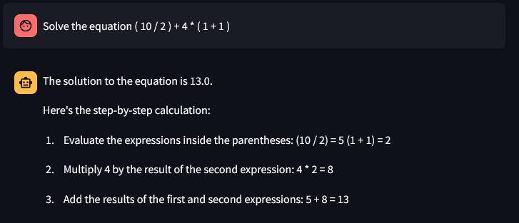
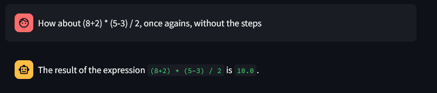
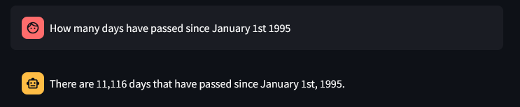
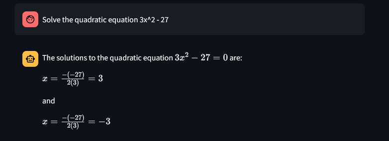
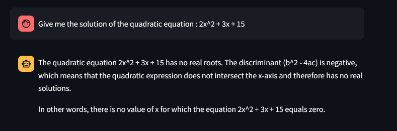

# Workshop-Hugging-face-langchain
By Alan Emilio Pérez León 

alan.leon@cetys.edu.mx

## ✅ Tasks

### 1. Basic Math Expressions





### 2. Date Difference Calculation



### 3. Temperature Conversion


### 4. Solve a Quadratic Equation







## Console Log

```
> Entering new AgentExecutor chain...

Invoking: `Calculator` with `( 10 / 2 ) + 4 * ( 1 + 1 )`


13.0The solution to the equation is 13.0.

Here's the step-by-step calculation:

1. Evaluate the expressions inside the parentheses:
   (10 / 2) = 5
   (1 + 1) = 2

2. Multiply 4 by the result of the second expression:
   4 * 2 = 8

3. Add the results of the first and second expressions:
   5 + 8 = 13

> Finished chain.
{'input': 'Solve the equation ( 10 / 2 ) + 4 * ( 1 + 1 )', 'output': "The solution to the equation is 13.0.\n\nHere's the step-by-step calculation:\n\n1. Evaluate the expressions inside the parentheses:\n   (10 / 2) = 5\n   (1 + 1) = 2\n\n2. Multiply 4 by the result of the second expression:\n   4 * 2 = 8\n\n3. Add the results of the first and second expressions:\n   5 + 8 = 13"}
C:\Users\tomat\anaconda3\envs\statisticWorks\Lib\site-packages\langsmith\client.py:272: LangSmithMissingAPIKeyWarning: API key must be provided when using hosted LangSmith API
  warnings.warn(
C:\Users\tomat\anaconda3\envs\statisticWorks\Lib\site-packages\langsmith\client.py:272: LangSmithMissingAPIKeyWarning: API key must be provided when using hosted LangSmith API
  warnings.warn(


> Entering new AgentExecutor chain...

Invoking: `Calculator` with `(5 + 2) * (5 -3) / 2`


7.0The solution to the equation is 7.0.

> Finished chain.
{'input': 'Solve the equation ( 5 + 2 ) * (5 -3) / 2 \ndont give me the steps', 'output': 'The solution to the equation is 7.0.'}
C:\Users\tomat\anaconda3\envs\statisticWorks\Lib\site-packages\langsmith\client.py:272: LangSmithMissingAPIKeyWarning: API key must be provided when using hosted LangSmith API
  warnings.warn(
C:\Users\tomat\anaconda3\envs\statisticWorks\Lib\site-packages\langsmith\client.py:272: LangSmithMissingAPIKeyWarning: API key must be provided when using hosted LangSmith API
  warnings.warn(


> Entering new AgentExecutor chain...

Invoking: `Calculator` with `(8+2) * (5-3) / 2`


10.0The result of the expression `(8+2) * (5-3) / 2` is `10.0`.

> Finished chain.
{'input': 'How about (8+2) * (5-3) / 2, once agains, without the steps', 'output': 'The result of the expression `(8+2) * (5-3) / 2` is `10.0`.'}
C:\Users\tomat\anaconda3\envs\statisticWorks\Lib\site-packages\langsmith\client.py:272: LangSmithMissingAPIKeyWarning: API key must be provided when using hosted LangSmith API
  warnings.warn(
C:\Users\tomat\anaconda3\envs\statisticWorks\Lib\site-packages\langsmith\client.py:272: LangSmithMissingAPIKeyWarning: API key must be provided when using hosted LangSmith API
  warnings.warn(


> Entering new AgentExecutor chain...

Invoking: `DateDifference` with `1995-01-01`


11116There are 11,116 days that have passed since January 1st, 1995.

> Finished chain.
{'input': 'How many days have passed since January 1st 1995', 'output': 'There are 11,116 days that have passed since January 1st, 1995.'}
C:\Users\tomat\anaconda3\envs\statisticWorks\Lib\site-packages\langsmith\client.py:272: LangSmithMissingAPIKeyWarning: API key must be provided when using hosted LangSmith API
  warnings.warn(
C:\Users\tomat\anaconda3\envs\statisticWorks\Lib\site-packages\langsmith\client.py:272: LangSmithMissingAPIKeyWarning: API key must be provided when using hosted LangSmith API
  warnings.warn(


> Entering new AgentExecutor chain...

Invoking: `TemperatureConversion` with `98.6`


37.0The temperature of 98.6 Fahrenheit is equivalent to 37.0 degrees Celsius.

> Finished chain.
{'input': 'Convert 98.6 Farenheit into Celsius please', 'output': 'The temperature of 98.6 Fahrenheit is equivalent to 37.0 degrees Celsius.'}
C:\Users\tomat\anaconda3\envs\statisticWorks\Lib\site-packages\langsmith\client.py:272: LangSmithMissingAPIKeyWarning: API key must be provided when using hosted LangSmith API
  warnings.warn(
C:\Users\tomat\anaconda3\envs\statisticWorks\Lib\site-packages\langsmith\client.py:272: LangSmithMissingAPIKeyWarning: API key must be provided when using hosted LangSmith API
  warnings.warn(


> Entering new AgentExecutor chain...

Invoking: `QuadraticSolver` with `3,0,-27`


First solution is 3.0 and the second solution is -3.0
The solutions to the quadratic equation $3x^2 - 27 = 0$ are:

$x = \frac{-(-27)}{2(3)} = 3$

and

$x = \frac{-(-27)}{2(3)} = -3$

> Finished chain.
{'input': 'Solve the quadratic equation  3x^2 - 27', 'output': 'The solutions to the quadratic equation $3x^2 - 27 = 0$ are:\n\n$x = \\frac{-(-27)}{2(3)} = 3$\n\nand \n\n$x = \\frac{-(-27)}{2(3)} = -3$'}
C:\Users\tomat\anaconda3\envs\statisticWorks\Lib\site-packages\langsmith\client.py:272: LangSmithMissingAPIKeyWarning: API key must be provided when using hosted LangSmith API
  warnings.warn(
C:\Users\tomat\anaconda3\envs\statisticWorks\Lib\site-packages\langsmith\client.py:272: LangSmithMissingAPIKeyWarning: API key must be provided when using hosted LangSmith API
  warnings.warn(


> Entering new AgentExecutor chain...

Invoking: `QuadraticSolver` with `1, -6, 9`


The solution is 3.0
The solutions to the quadratic equation x^2 - 6x + 9 are x = 3.0 and x = 3.0.

> Finished chain.
{'input': "Solve the quadratic equation x^2 -6x +9 , don't bother with the steps", 'output': 'The solutions to the quadratic equation x^2 - 6x + 9 are x = 3.0 and x = 3.0.'}
C:\Users\tomat\anaconda3\envs\statisticWorks\Lib\site-packages\langsmith\client.py:272: LangSmithMissingAPIKeyWarning: API key must be provided when using hosted LangSmith API
  warnings.warn(
C:\Users\tomat\anaconda3\envs\statisticWorks\Lib\site-packages\langsmith\client.py:272: LangSmithMissingAPIKeyWarning: API key must be provided when using hosted LangSmith API
  warnings.warn(


> Entering new AgentExecutor chain...

Invoking: `QuadraticSolver` with `2,3,15`


No real roots
The quadratic equation 2x^2 + 3x + 15 has no real roots. The discriminant (b^2 - 4ac) is negative, which means that the quadratic expression does not intersect the x-axis and therefore has no real solutions.

In other words, there is no value of x for which the equation 2x^2 + 3x + 15 equals zero.

> Finished chain.
{'input': 'Give me the solution of the quadratic equation : 2x^2 + 3x + 15', 'output': 'The quadratic equation 2x^2 + 3x + 15 has no real roots. The discriminant (b^2 - 4ac) is negative, which means that the quadratic expression does not intersect the x-axis and therefore has no real solutions.\n\nIn other words, there is no value of x for which the equation 2x^2 + 3x + 15 equals zero.'}
C:\Users\tomat\anaconda3\envs\statisticWorks\Lib\site-packages\langsmith\client.py:272: LangSmithMissingAPIKeyWarning: API key must be provided when using hosted LangSmith API
  warnings.warn(

```
