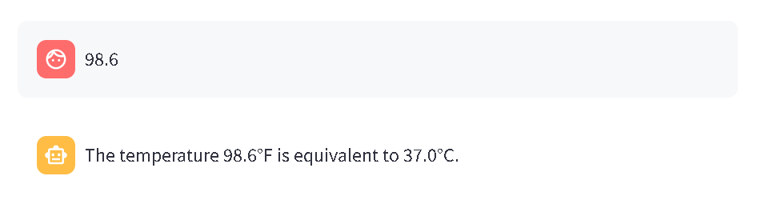

# Workshop-Hugging-face-langchain

# 🧠 Homework: Building Custom Tools with LangChain Agents

In this assignment, you'll define and implement custom tools that can be used by an agent to solve problems a language model might struggle with on its own. These tools will cover math, date manipulation, and temperature conversion.

## ✅ Tasks

### 1. Basic Math Expressions
Create tools that evaluate the following expressions:

- Compute the result of: `(10 / 2) + 4 * (1 + 1)`


- Calculate the result of: `(8 + 2) * (5 - 3) / 2`


> 💡 Each tool should receive the expression as a string input and return the result as a string.

---

### 2. Date Difference Calculation
Create a tool that answers the following:

- How many days have passed from `January 1, 1995` to **today**?


> 💡 The tool should accept a date in `YYYY-MM-DD` format and return the number of days between that date and today.

---

### 3. Temperature Conversion
Build a tool for converting temperatures:

- Create a tool that takes a temperature in **Fahrenheit** (e.g., `"98.6"`)  
  and returns the equivalent in **Celsius** using the formula:

```text
(F - 32) * 5 / 9
````



---

### 4. Solve a Quadratic Equation

Implement a tool to solve quadratic equations:

* Create a tool that takes three coefficients `a`, `b`, and `c`, and returns the real roots (if they exist) of the equation:

```text
ax² + bx + c = 0
```

Use the **quadratic formula**:

```text
(-b ± sqrt(b² - 4ac)) / (2a)
```

> 💡 Handle cases where there are:
>
> * Two real roots


> * One real root


> * No real roots (discriminant < 0)


---

## 🔄 Tool Format

Each tool should:

* Accept input(s) as string(s)
* Return a string result
* Be wrapped in a LangChain-compatible `Tool` object (or use a standard function first if you're not ready for LangChain yet)

---

## 🚀 Bonus Challenge (Optional)

Add type checks and error handling for invalid input, and provide helpful error messages.

---

Happy building! 🛠️

